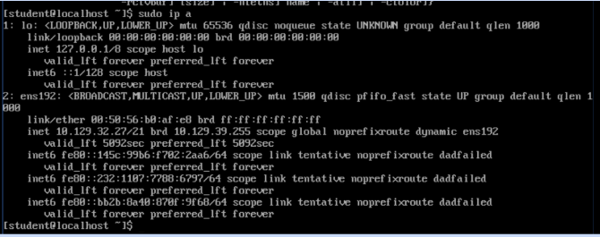

# Checkpoint 1

Everything in between angle brackets <> are meant to be filled in.

## Preperation

To start you will probably need a VPN connection to school. You can do that with [this link](https://ikdoeict.freshdesk.com/support/solutions/articles/31000136666-howto-verbinding-maken-naar-het-schoolnetwerk-via-vpn). Also, as you will find out, you have no internet connection using the VPN, you can fix that with [this link](https://ikdoeict.freshdesk.com/support/solutions/articles/31000137414-solution-ik-kan-niet-surfen-via-de-vpn).

## Base configuration (1.2)

Surf to [the cloud](https://cloud.ikdoeict.be/vcac) and make a new implementation of the course. Then fire them up and use VMRC to connect to the server (CentOS). Also the implementation will expire every 2 days, this is to force you to release all the resources, so everytime to work you will have to extend the lease of the implementation with 2 days. When expired you cannot start the machines.

The server has the a user with administrator rights named **student** with the password **Azerty123**. So log in and change the password ASAP using `sudo passwd student`.

The client has the same user and password, but that isnt as important to change in this excersize, as this is server focused, not client.

Also my machine did not have nano installed. As I am personally more familiar with nano, I installed it using `yum install nano`.

### Network configuration (1.2.1)

Firstly we need to get our networking in order, so on the server we simply type `sudo ip a` and take note of all internet adapters. As you can see below ours is **ens192**. The lo is simply a loopback.



Alright, now that we know _what_ to change, let's do it! We will go to the file containing the basic network config and edit it. `sudo nano /etc/sysconfig/network-scripts/ifcfg-<adapter>`

The things you want to edit are:
```
ONBOOT=yes
BOOTPROTO=static
NM_CONTROLLED=no
IPADDR=<ip_server>
NETMASK=<subnet_server>
GATEWAY=<default_gateway>
```

Next up we are going to change the hostname, this is done simply with `set-hostname <name>`.

Afterwards go to `sudo nano /etc/resolv.conf` and add or edit the file to contain your wanted DNS's.
```
nameserver <dns>
```

Then, to finish up we are going to restart the service. This is done with `systemctl restart network`.
If everything is right you should be able to ping. This can be done by doing the following tests.
- `ping <default_gateway>` upon failure your gateway/mask is wrong.
- `ping 8.8.8.8` there is no connection to outside.
- `ping google.com` the DNS is wrong.

### MOBAXTERM 

Before we go any further, let's go to our client and also change the network settings. This is done by GUI so that shouldn't be that much of a problem.
Don't forget to ping so you know it works.

Then on your client you will want to install XRDP. This will allow Remote desktop connections. Do this by opening a terminal and doing the following:
```
sudo apt install xrdp
sudo systemctl enable xrdp
sudo apt-get install xfce4
sudo echo xfce4-session >~/.xsession
sudo nano /etc/xrdp/startwm.sh
```
The file should look like: (add the last line)
```
#!/bin/sh

if [ -r /etc/default/locale ]; then
  . /etc/default/locale
  export LANG LANGUAGE
fi

startxfce4
```
Then finish up with a `sudo service xrdp restart`.

Now you can use mobaXterm to make a RDP connection to your client. The same can be done for the server, but as a SSH connection. This will make it easier to use, since we won't be needing to use VMRC and have simple tabs to open the wanted machine.

### Remote Access (1.2.2)

Firstly it is handy to take note of where the login attempts are stored on the server, `/var/log/secure`. Also it might be handy to take notice of where approved SSH keys are stored `~/.ssh/authorized_keys`.

Now we access our client and create a simple SSH key 
```
ssh-keygen -t rsa -b 4096
ssh-copy-id student@<ip_server>
```
This will create a keypair on the client and send a public key to the server, this way we can SSH from a client to the server, incase we cant access the machine physically.

To check if it is running simply use `/sbin/service sshd status` on the server.

To make this connection simply `ssh student@<ip_server>` from the client.

## The FHS (1.3)

There are 2 major indicators of each file in Linux. That being Sharability and Variability. A non sharable file is a file that is personal to the system (think of configs) and a unvariable file is a file that shouldn't change other than by a sysadmin (think boot). both of them have their inverts and those can be combined to form 4 categories of files.

Some fun tidbits of paths are:
- `/proc/meminfo` (information memory)
- `/etc/sysconfig/firewalld` (Firewall config)
- `/bin/ssh-keygen` (ssh key generator)
- `/home/student/desktop` (location of the desktop for Student)